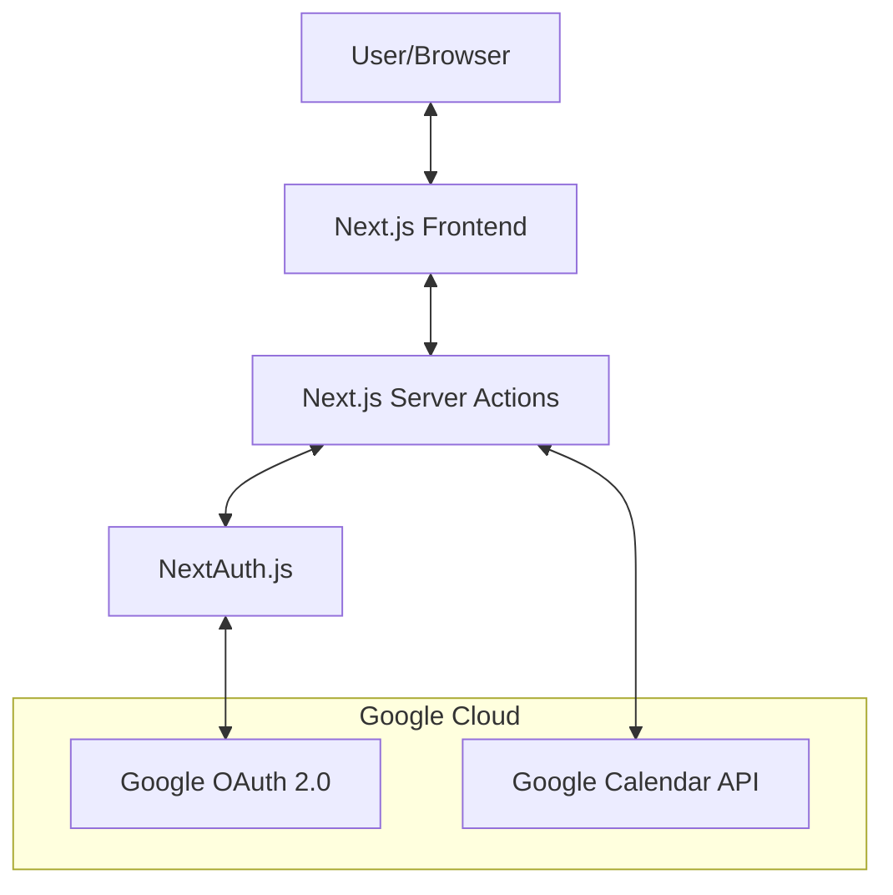
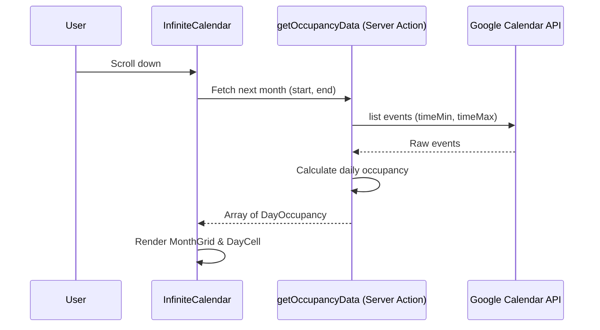

# Project Architecture: Daily Occupancy Dashboard

## Purpose
The **Daily Occupancy Dashboard** is a web application designed to help users visualize their time commitment across their Google Calendars. It calculates and displays daily occupancy for each selected calendar individually, allowing users to see how much time is spent on different areas of their life (e.g., Work, Personal, Side Projects). This tool is particularly useful for tracking work-life balance and identifying meeting-heavy periods across multiple calendars.

## Architecture Overview
The project follows a modern **Next.js App Router** architecture, leveraging Server Components and Server Actions for efficient data fetching and security.

### System Diagram (Mermaid)

## Technical Stack
- **Framework**: [Next.js 15+](https://nextjs.org/) (App Router)
- **Authentication**: [NextAuth.js v5](https://authjs.dev/) (using Google Provider)
- **API Integration**: [googleapis](https://www.npmjs.com/package/googleapis) for Google Calendar access.
- **Styling**: [Tailwind CSS 4](https://tailwindcss.com/)
- **Icons**: [Lucide React](https://lucide.dev/)
- **Date Manipulation**: [date-fns](https://date-fns.org/)
- **Infinite Scrolling**: [react-intersection-observer](https://www.npmjs.com/package/react-intersection-observer)

## Information Flow

### 1. Authentication & Authorization
The application uses Google OAuth 2.0 to authenticate users and request read-only access to their primary calendar.

1.  **Login**: User initiates sign-in via `signIn("google")`.
2.  **Permissions**: Request includes the `https://www.googleapis.com/auth/calendar.readonly` scope.
3.  **Session Management**: NextAuth handles JWT and session management. The access token is stored in the session for subsequent API calls.
4.  **Token Refresh**: A custom callback in `src/auth.ts` automatically handles refreshing the Google access token using the refresh token when it expires.

### 2. Data Fetching (Server-Side)
Data fetching is handled via **Server Actions** to keep secrets (like API keys) and complex logic on the server.

1.  **Request**: The `InfiniteCalendar` component triggers `getOccupancyData(startDate, endDate)` (a server action).
2.  **API Call**: The server action retrieves the user's `accessToken` from the session and calls `getCalendarEvents` in `src/lib/google-calendar.ts`.
3.  **Filtering & Calculation**: 
    - The `calculateOccupancy` function processes events grouped by calendar.
    - It filters out non-occupancy events (e.g., "Out of Office", "Lunch", "Free" slots).
    - It merges overlapping events *within each calendar* to calculate net occupancy hours per calendar.
4.  **Response**: An array of `DayOccupancy` objects, each containing a list of `CalendarOccupancy` (with hours, color, and metadata), is returned to the client.

### 3. Frontend Visualization
The UI is built with a focus on usability and performance.

## Key Components

- **`src/app/page.tsx`**: Entry point. Handles the login/landing state and renders the `InfiniteCalendar` once authenticated.
- **`src/components/InfiniteCalendar.tsx`**: The core container. Uses `react-intersection-observer` to implement infinite scrolling by dynamically loading months as the user scrolls.
- **`src/components/MonthGrid.tsx`**: Renders a single month's grid layout.
- **`src/components/DayCell.tsx`**: Renders an individual day, showing multiple progress bars—one for each selected calendar—using the calendar's specific color. Each bar represents occupancy relative to an 8-hour daily target.
- **`src/lib/google-calendar.ts`**: Contains all logic for interacting with the Google Calendar API and calculating occupancy metrics.

## Configuration
The app's behavior can be customized via environment variables:
- `AUTH_GOOGLE_ID` / `AUTH_GOOGLE_SECRET`: Google OAuth credentials.
- `NEXT_PUBLIC_BIZ_START` / `NEXT_PUBLIC_BIZ_END`: Default business hour range.
- `DEBUG`: If set to `1`, the app enables "Debug Mode". In this mode:
  - If a user is **not logged in**, the app uses mock data for visualization.
  - If a user **is logged in**, the app uses their real Google Calendar data, but still displays the "DEBUG MODE" banner.
  - The "DEBUG MODE" banner is always visible when this is set to `1`.
